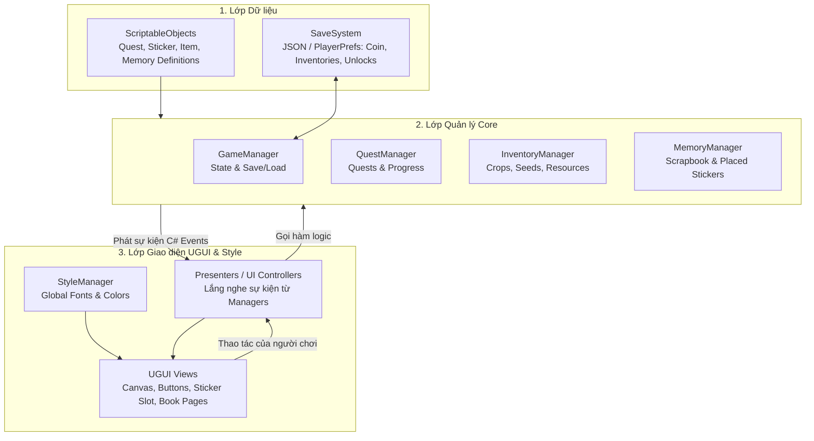

# Tài liệu Thiết kế Kỹ thuật (Technical Design Document) - Xóm Nhỏ Tuổi Thơ

## I. Tổng quan Dự án

*   **Tên dự án:** Xóm Nhỏ Tuổi Thơ
*   **Thể loại:** Cozy Life Sim (Mô phỏng cuộc sống nhẹ nhàng), Decor, Sưu tầm, Sổ tay/Sticker
*   **Nền tảng mục tiêu:** Android, iOS
*   **Fantasy chính:** *"Mỗi ngày sửa lại một góc nhỏ của tuổi thơ"* thông qua tương tác tĩnh cảm xúc, hạn chế tối đa animation phức tạp và world-space chuyển động lớn.

---

## II. Quy chuẩn Lập trình & Kiến trúc Cốt lõi (Coding Guidelines)

Để đảm bảo hiệu năng tối ưu trên thiết bị di động (đặc biệt là quản lý bộ nhớ, hạn chế Garbage Collection - GC Allocations) và tăng khả năng bảo trì khi dự án phình to, toàn bộ dự án bắt buộc tuân thủ 4 quy tắc vàng sau:

### 2.1. Dependency Injection (VContainer) thay thế hoàn toàn Singleton
*   **Quy tắc:** Tuyệt đối không sử dụng mẫu thiết kế Singleton tĩnh toàn cục (`Manager.Instance`). Tất cả các Service, Manager và Presenter phải được quản lý vòng đời và giải quyết phụ thuộc (Dependency Resolution) thông qua **VContainer**.
*   **Triển khai:** Đăng ký các dịch vụ trong lớp `GameLifetimeScope` của VContainer và thực hiện **Constructor Injection** cho các lớp C# thuần, hoặc **Inject method/field** cho các MonoBehaviour.

### 2.2. Tránh Coroutine - Sử dụng UniTask cho Bất đồng bộ
*   **Quy tắc:** Cấm sử dụng `IEnumerator` và `StartCoroutine` của Unity. Toàn bộ các tác vụ bất đồng bộ (chờ đợi thời gian cây lớn, đợi DOTween chạy xong, tải cảnh, đọc file) phải dùng **UniTask** của Cysharp để đạt hiệu quả **Zero GC Allocation**.
*   **Ràng buộc:** Tất cả hàm `async UniTask` hoặc `async UniTaskVoid` bắt buộc phải truyền `CancellationToken` (thường là `this.GetCancellationTokenOnDestroy()`) để giải phóng tác vụ nếu object bị hủy giữa chừng.

### 2.3. Tuân thủ Nguyên lý Đảo ngược Phụ thuộc (Dependency Inversion Principle - DIP)
*   **Quy tắc:** Các lớp giao diện mức cao (UI, Presenter, Style Configs) không được tham chiếu trực tiếp đến các lớp triển khai logic mức thấp (Dịch vụ vật lý). Tất cả giao tiếp giữa các tầng phải đi qua các **Interface** (Abstractions) được đăng ký trong DI Container.

### 2.4. Tối ưu hóa Bộ nhớ Struct (Memory Alignment & Zero GC)
*   **Phạm vi áp dụng:**
    *   **Bắt buộc dùng `struct` tối ưu bộ nhớ:** Chỉ áp dụng cho các dữ liệu runtime nhỏ, liên tục thay đổi hoặc truyền tải dưới dạng sự kiện (Event), và hoàn toàn KHÔNG chứa kiểu tham chiếu (như `string`, `class` hay `UnityEngine.Object`). Ví dụ: `StickerPlacedData`, `CropState`, `ChickenState`.
    *   **Không lạm dụng `struct`:** Các cấu trúc dữ liệu cấu hình chứa kiểu tham chiếu (ví dụ: `TextStyle` chứa `string` và `TMP_FontAsset`) bắt buộc phải dùng **`class`** thông thường. Việc dùng struct có chứa managed reference kết hợp `StructLayout` không giúp tối ưu bộ nhớ và dễ sinh lỗi.
*   **Căn lề bộ nhớ (Padding):** Để tối ưu từng bit dữ liệu cho các runtime structs hợp lệ, các struct bắt buộc:
    *   Sắp xếp thứ tự các trường dữ liệu từ lớn đến nhỏ (8 bytes -> 4 bytes -> 2 bytes -> 1 byte) để tránh compiler chèn byte trống (padding).
    *   Hoặc sử dụng thuộc tính `[StructLayout(LayoutKind.Sequential, Pack = 1)]` để đóng gói khít dữ liệu.
*   *Lưu ý:* Tránh ép kiểu `struct` về `interface` lúc truyền nhận để ngăn ngừa hiện tượng **Boxing** sinh rác trên Heap.

---

## III. Kiến trúc Hệ thống Tổng thể

Hệ thống được chia thành 3 tầng tách biệt rõ ràng theo mô hình **Event-Driven MVP (Model-View-Presenter)**. Hệ thống quản lý giao diện và Style (StyleManager, StyleConfig) thuộc về **Presentation / UI Layer**, giữ cho Core Domain Layer hoàn toàn sạch bóng các khái niệm liên quan đến UI:



1.  **Data Layer (Lớp Dữ liệu):** 
    *   *Dữ liệu tĩnh:* Định nghĩa trong các `ScriptableObject` (công thức, loại hạt giống, chỉ số sticker).
    *   *Dữ liệu lưu trữ:* Chuyển đổi thành cấu trúc Struct và lưu dưới dạng JSON mã hóa nhẹ.
2.  **Core Domain Layer (Lớp Logic Core):**
    *   Các C# Class thuần túy thực thi các Interface tương ứng (`IQuestService`, `IFarmService`, `ISaveService`). Lớp này hoàn toàn không phụ thuộc vào TextMeshPro hay UGUI. Trạng thái thay đổi phát đi các C# Event chuẩn.
3.  **UI & Style MVP Layer (Tầng hiển thị):**
    *   *StyleManager / StyleConfig:* Nằm hoàn toàn ở tầng UI. Cung cấp tài nguyên giao diện động cho các View.
    *   *View:* Các thành phần UGUI tĩnh nhận lệnh hiển thị và phát tín hiệu tương tác.
    *   *Presenter:* Lớp trung gian nhận Event từ Core Service để cập nhật lên View, và nhận lệnh từ View gửi về Core Service.

---

## IV. Chi tiết Thiết kế các Module Cốt lõi

### 4.1. Hệ thống Sổ tay Ký ức & Dán Sticker Tự do

Hệ thống này cho phép người chơi mở khóa các kỷ niệm tuổi thơ dưới dạng các trang sổ tay và tự do trang trí bằng sticker thu thập được.

#### 4.1.1. Struct lưu trữ tối ưu hóa bộ nhớ
```csharp
using System.Runtime.InteropServices;

[StructLayout(LayoutKind.Sequential, Pack = 1)]
public struct StickerPlacedData
{
    public int StickerId;      // 4 bytes: ID định danh sticker
    public float PositionX;    // 4 bytes: Tọa độ X tương đối (0.0f đến 1.0f) trên trang sách
    public float PositionY;    // 4 bytes: Tọa độ Y tương đối (0.0f đến 1.0f) trên trang sách
    public float RotationZ;    // 4 bytes: Góc xoay của sticker
    public float Scale;        // 4 bytes: Tỉ lệ phóng to/thu nhỏ (mặc định 1.0f)
    public ushort PageIndex;   // 2 bytes: Chỉ số trang sách dán sticker này
    public bool IsFlipped;     // 1 byte: Trạng thái lật ngược sticker
} // Tổng cộng: 23 bytes (Zero padding)
```

#### 4.1.2. Cơ chế tương tác & Micro-feedback cảm xúc (UGUI + DOTween)
*   **On Begin Drag:** Khi nhấc sticker lên từ khay chứa, sử dụng DOTween phóng to sticker lên `1.1f` trong `0.15s`. Dịch chuyển ảnh bóng đổ (Shadow) phía dưới lệch xuống khoảng 15px để mô phỏng chiều sâu vật lý.
*   **On End Drag:**
    *   *Vị trí hợp lệ:* Sticker tự động co lại `1.0f` với hiệu ứng `Ease.OutBounce`, phát âm thanh dán giấy nhẹ, ảnh bóng đổ thu sát lại mặt giấy.
    *   *Vị trí không hợp lệ:* Dùng DOTween `DOMove` bay ngược về khay chứa trong `0.3s`, `Ease.OutQuad`.
*   **Chế độ Chỉnh sửa (Edit Mode):** Nhấn giữ `0.5s` vào một sticker đã dán trên trang sách sẽ kích hoạt chế độ chỉnh sửa. Sticker sẽ lắc lư nhẹ (`DOShakeRotation` lặp vô hạn). Xuất hiện các nút chức năng xoay/phóng to và nút thu hồi.
*   **Lật trang 2D Giả 3D (Page Flip):** Sử dụng một Sprite trang giấy lật trung gian. Dùng DOTween `DOScaleX` bóp méo trục X của Sprite này từ `1.0f` về `0.0f` rồi giãn ngược lại. Tại điểm `ScaleX = 0`, tráo đổi Sprite nội dung của trang cũ thành trang mới.

---

### 4.2. Hệ thống Trồng trọt nhẹ & Chăn nuôi gà

Mô phỏng sự phát triển của nông trại theo thời gian thực (real-time offline progress) mà không làm tốn hiệu năng CPU.

#### 4.2.1. Struct lưu trữ trạng thái nông trại
```csharp
[StructLayout(LayoutKind.Sequential, Pack = 1)]
public struct CropState
{
    public int CropId;              // 4 bytes: ID loại cây trồng
    public long PlantedTimestamp;    // 8 bytes: Unix UTC timestamp lúc trồng
    public long LastWateredTimestamp;// 8 bytes: Unix UTC timestamp tưới nước gần nhất
    public byte SlotIndex;          // 1 byte: Vị trí ô đất (0 - 5)
    public byte GrowthStage;        // 1 byte: Giai đoạn lớn (0: Hạt, 1: Mầm, 2: Cây non, 3: Thu hoạch)
} // Tổng cộng: 22 bytes
```

#### 4.2.2. Cơ chế mô phỏng thời gian thực bằng UniTask
*   **Tính toán Offline (Khi mở game):** Lấy thời gian UTC hiện tại trừ đi `PlantedTimestamp` để cập nhật lập tức `GrowthStage` tương ứng mà cây đã đạt được trong thời gian người chơi vắng mặt.
*   **Cập nhật Online (Vòng lặp nền):** Sử dụng một vòng lặp UniTask nền chạy mỗi **1 giây một lần** trong `FarmService` thay cho hàm `Update` của Unity:
    ```csharp
    private async UniTaskVoid StartGrowthLoop(CancellationToken token)
    {
        while (!token.IsCancellationRequested)
        {
            await UniTask.Delay(1000, cancellationToken: token);
            UpdateGrowthLogic(); // Cập nhật trạng thái và phát sự kiện OnCropGrown nếu chuyển giai đoạn
        }
    }
    ```
*   **Hiệu ứng phản hồi vật lý:**
    *   *Tưới nước:* Bình tưới nước UGUI nghiêng `45 độ` bằng DOTween, lắc nhẹ (`DOShakeRotation`), sau đó cây trồng rung rinh (`DOShakePosition`) báo hiệu nhận nước.
    *   *Chăn nuôi (Gà thở):* Kích hoạt một lệnh DOTween lặp vô hạn dạng Yoyo để bóp nhẹ gà theo trục Y (`DOScaleY` từ `0.98f` đến `1.02f`), mô phỏng nhịp thở tự nhiên. Khi vuốt ve, gà nhẩy lò cò (`DOJump`) kèm bong bóng trái tim bay ra.

---

### 4.3. Hệ thống Style & Phân mảnh Giao diện theo Theme (Style & Structural Theme Manager)

Hệ thống giúp quản lý linh hoạt toàn bộ giao diện từ màu sắc, font chữ cho đến cấu trúc nút bấm phức tạp, đồng thời đem lại trải nghiệm thiết kế giao diện trực quan tuyệt vời trên Unity Editor.

#### 4.3.1. Thiết kế Style cấu trúc (TextStyle Class)
`TextStyle` và `UIStyleConfig` thuộc hoàn toàn về tầng UI (Presentation Layer). Do có chứa kiểu tham chiếu (`string` và `TMP_FontAsset`), `TextStyle` được thiết kế dưới dạng **`class`** thông thường:

```csharp
[Serializable]
public class TextStyle
{
    public string StyleKey;           // Khóa định danh: ví dụ "QuestTitle_Green", "Diary_OldPaper"
    public TMP_FontAsset FontAsset;   // Font chữ
    public Color Color;               // Màu chữ
    public float FontSizeOffset;      // Căn chỉnh kích thước
}
```

Các Component vệ tinh `UIStyleElement` gắn trên Text/Image chỉ định `_styleKey = "Diary_OldPaper"`. Để tránh bug cộng dồn font size khi đổi theme, `UIStyleElement` bắt buộc phải **cache kích thước font gốc (`_baseFontSize`) tại thời điểm Awake/Start**, sau đó áp dụng:
`_textComponent.fontSize = _baseFontSize + textStyle.FontSizeOffset;`

#### 4.3.2. Thay đổi cấu trúc giao diện triệt để bằng Prefab Swapping
*   **Thách thức:** Khi **Theme A** yêu cầu Nút bấm có cấu trúc phức tạp (5 lớp nền + 1 Icon + 1 Text) còn **Theme B** yêu cầu cấu trúc tối giản (1 lớp nền + 1 Text + 0 Icon), việc bật/tắt thủ công rất dễ lỗi.
*   **Giải pháp:** Áp dụng **Prefab Swapping**. Mỗi Theme (`UIStyleConfig`) sẽ lưu trữ trực tiếp đường dẫn/tham chiếu đến Prefab nút bấm đặc trưng của Theme đó:
    `public GameObject PrimaryButtonPrefab;`
*   Lúc game chạy, View/Presenter sẽ sinh ra (Instantiate) Nút bấm tương ứng với Prefab mẫu của Theme hiện tại.

#### 4.3.3. Hiển thị trực quan trên Editor bằng Kỹ thuật Preview Spawner
Để nhà thiết kế UI không phải nhìn các GameObject trống trơn trên Editor, chúng ta xây dựng script `CozyWidgetPlaceholder` chạy ở chế độ **Edit Mode** (`[ExecuteAlways]`):

1.  Trong Editor, script tự động đọc file cấu hình `UIStyleConfig` đang active.
2.  Tạo ra (Instantiate) một bản sao nút bấm của Theme đó làm con của Placeholder.
3.  **Khóa chốt kỹ thuật:** Gán cờ `HideFlags` cho bản sao Preview:
    `previewInstance.hideFlags = HideFlags.DontSave;`
    *Cờ này báo hiệu cho Unity Editor KHÔNG bao giờ được phép lưu đè GameObject Preview này vào file Scene hay file Prefab gốc, giữ vững sự sạch sẽ cho Git và tránh xung đột mã nguồn.*
4.  **Hủy đối tượng trùng lặp:** 
    *   Script quản lý tách biệt tham chiếu `_previewInstance` (chỉ tồn tại ở Editor) và `_runtimeInstance` (chỉ sinh ra lúc Play game).
    *   Trước khi Instantiate đối tượng mới (editor preview hoặc runtime instance), script bắt buộc kiểm tra và hủy đối tượng cũ thích hợp (`DestroyImmediate` cho preview trong editor, `Destroy` cho instance lúc play game) để tránh rò rỉ và trùng lặp con đè lên nhau.

---

## V. Kế hoạch Kiểm thử & Xác minh (Verification Plan)

### 5.1. Kiểm thử Tối ưu hóa Bộ nhớ (Profiler & GC Alloc)
*   **Mục tiêu:** 
    *   Đạt **0 byte recurring GC Allocation (Không sinh rác tuần hoàn)** trong Core Service Loop sau giai đoạn warm-up (timer trồng trọt nền, nhịp thở của gà đang chạy ổn định).
    *   Tối thiểu hóa tối đa GC Alloc cho các tương tác UI (kéo thả sticker, nhấp thả) ở mức cực nhỏ (dưới 100 bytes cho một lần nhấc/thả để khởi tạo tween/event), tuyệt đối không sinh rác rò rỉ liên tục trong suốt quá trình di chuyển ngón tay (dragging).
*   **Công cụ:** Unity Profiler (CPU Usage & Memory Allocation).
*   **Phương pháp:** Bật Profiler, thực hiện kéo thả sticker liên tục 20 giây và quan sát biểu đồ. Đợi chu kỳ trồng trọt chạy nền 1 phút để xác minh không có cột rác GC đột biến phát sinh tuần hoàn.

### 5.2. Kiểm thử Hiển thị Editor Preview
*   **Mục tiêu:** Thay đổi cấu hình Theme trong Editor và giao diện trong Scene View của Unity Editor lập tức thay đổi trong thời gian thực mà không cần nhấn Play.
*   **Phương pháp:**
    1. Mở Scene thiết kế chứa các Placeholder Button.
    2. Trong cửa sổ Inspector của `CozyWidgetPlaceholder`, thay đổi kéo thả tham chiếu `_editorOnlyConfig` từ `Theme_A` sang `Theme_B`.
    3. Xác nhận bằng mắt thường: Các nút bấm lập tức được tái tạo, đổi hình dạng từ phức tạp (Theme A) sang tối giản (Theme B) trong Scene View.
    4. Kiểm tra Git Status: File Scene không phát sinh thay đổi rác của các GameObject con Preview (được bảo vệ nhờ `HideFlags.DontSave`).
    5. Chạy game (Play Mode): Gọi `ApplyTheme(Theme_B)` trên `IStyleService` và kiểm tra nút bấm tráo đổi thành công tại runtime.

---

Tài liệu này được phê duyệt làm kim chỉ nam kỹ thuật chính thức cho sự phát triển dự án **Xóm Nhỏ Tuổi Thơ**.
