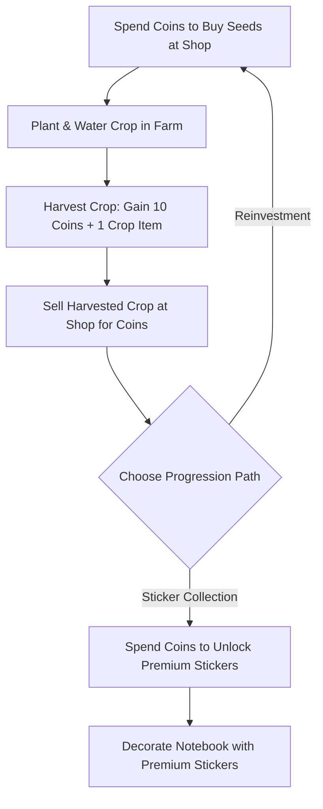

# Technical Design: Inventory & Reward Progression Loop (Task 23)

This design document outlines the implementation plan to close the core gameplay loop of Cozy Life Sim by building a data-driven Tiem Tap Hoa (Shop), converting the static sidebar into a compact navigation dock, implementing a reusable dimming/click-blocking Cozy Popup System (perfectly compatible with the CuteKawaiiGUIPack assets), and establishing a robust crop-selling and sticker-unlocking progression loop.

---

## 1. System Overview & Core Loop

Currently, players have a hard limit of 5 seeds and no way to earn coins except by harvesting crops (which instantly gives 10 coins and adds 1 crop to inventory). Once those 5 seeds are gone, the gameplay loop halts. 

This design establishes a sustainable and rewarding core loop:



### Scope & Constraints (Prototype Level)
- **Single-Crop Scope:** In order to prevent excessive feature creep, the inventory and shop transaction logic is scoped to the single-crop prototype level (using the default White Acorn / cropId 1). The `cropId` parameter will be accepted in API signatures for forward-compatibility (looking up prices from `CropDatabase`), but under the hood, it modifies the global aggregate `Seeds` and `Crops` values in `IInventoryService`.
- **Commit Guard:** In accordance with AGENTS.md, absolutely no git commits or pushes will be performed during implementation unless explicitly requested by the user.

---

## 2. Technical Architecture & Components

```
+------------------------------------------------------------------------+
|                               UI LAYER                                 |
|                                                                        |
|  +-----------------+       +-----------------+       +--------------+  |
|  |   CozySidebar   |       |   QuestPopup    |       |  ShopPopup   |  |
|  | (Compact Dock)  |       | (Reusable Cozy) |       | (Buy/Sell)   |  |
|  +--------+--------+       +--------+--------+       +------+-------+  |
+-----------|-------------------------|-----------------------|----------+
            | Triggers Open()         | Query / Progress      | Transaction Calls
+-----------v-------------------------v                       |          |
|                           PRESENTER LAYER                   |          |
|                                                             |          |
|                                                         +---v-------------+            |
|                                                         |  ShopPresenter  |            |
|                                                         +--------+--------+            |
+------------------------------------------------------------------|-----+
                                                                   | DI Injection
+------------------------------------------------------------------v-----+
|                           SERVICE LAYER                                |
|                                                                        |
|      +----------------------+           +----------------------+       |
|      |     QuestService     |           |     ShopService      |       |
|      +----------+-----------+           +----------+-----------+       |
|                 |                                  |                   |
|                 +--------------+-------------------+                   |
|                                |                                       |
|                                | Mutates / Query                       |
|                      +---------v---------+                             |
|                      |  InventoryService |                             |
|                      +---------+---------+                             |
|                                |                                       |
|                                | Reads / Writes                        |
|                      +---------v---------+                             |
|                      |    SaveService    |                             |
|                      |   (SaveData.cs)   |                             |
|                      +-------------------+                             |
+------------------------------------------------------------------------+
```

### A. Data Layer Modifications
We will enrich our existing core data types to support data-driven prices and unlock progress:

1. **SaveData.cs**
   - `public List<int> UnlockedStickerIds = new List<int> { 1, 2 };`
   - Default initialization: Bootstrap with sticker IDs 1 and 2 unlocked.

2. **SaveService.NormalizeSaveData()**
   - Ensure that older saves on disk get normalized correctly. If `UnlockedStickerIds` is null, instantiate it as a new `List<int>`. Ensure default IDs 1 and 2 exist in the list by adding them if missing, preserving any other custom stickers.

3. **CropTemplate.cs**
   - `public int BuyPrice = 5;` (Cost to purchase 1 seed packet)
   - `public int SellPrice = 15;` (Revenue earned by selling 1 crop)

4. **StickerTemplate.cs**
   - `public int BuyPrice = 50;` (Cost to unlock this decorative sticker)

---

### B. Core Services Layer
We introduce the transaction controller:

1. **`IShopService` (Interface) & `ShopService` (Implementation)**
   - `bool TryBuySeed(int cropId)`: Validates coins -> deducts coins via `InventoryService` -> adds seed via `InventoryService` -> saves. Gracefully aborts and returns `false` if `CropDatabase` lacks price data or the template is missing.
   - `bool TrySellCrop(int cropId)`: Validates crop inventory -> deducts crop -> adds coins -> saves. Gracefully aborts if template is missing.
   - `bool TryBuySticker(int stickerId)`: Validates coins & not already unlocked -> deducts coins -> adds ID to `UnlockedStickerIds` -> saves. Gracefully aborts if template is missing.
   - `bool IsStickerUnlocked(int stickerId)`: Checks if the sticker ID exists in `UnlockedStickerIds`.
   - `event Action OnShopTransactionSuccess`: Invoked to refresh the Shop UI and StickerBook tray on successful transactions. (Note: We use this global event as a simple prototype trade-off).

---

### C. UI Presentation Layer

#### 1. Reusable Cozy Popup System (`CozyPopup.cs`)
A base UI class ensuring elegant, standardized modal panels:
- **DIM BACKING Overlay:** A full-screen dim Panel image GameObject with an `Image` component (`Color = new Color(0, 0, 0, 0.4f)` and `Raycast Target = true` to block clicks) along with a `CanvasGroup` component to control alpha fading.
- **DOTWEEN TRANSITIONS:**
  - `Open()`: Fades overlay from 0 to 1 (`0.2s`); scales main content panel from `0.8f` to `1.0f` with `Ease.OutBack` (`0.3s`).
  - `Close()`: Fades overlay from 1 to 0 (`0.15s`); scales main content panel from `1.0f` to `0.8f` with `Ease.InBack` (`0.15s`), then disables GameObject.

#### 2. Compact Sidebar Dock (`CozySidebar.cs`)
Refactored to be a compact, non-sliding vertical dock sitting cleanly at the edge of the screen, holding button icons:
- Button Q (Quest): Calls `QuestPopup.Open()`.
- Button S (Shop): Calls `ShopPopup.Open()`.

#### 3. Shop UI (`ShopPopup.cs`)
Inherits from `CozyPopup`. Directly injects `ShopPresenter`, `CropDatabase`, `StickerDatabase`, and `IInventoryService` to query values, while all transactional mutator calls go through the injected `ShopPresenter` to respect MVP pattern layers.
Displays two clear sections using CuteKawaiiGUIPack assets:
- **Buy Stall:**
  - **Seed Packets Grid:** Renders seed packets from `CropDatabase`. Displays price, current inventory, and a clicky Buy button.
  - **Stickers Grid:** Renders sticker items from `StickerDatabase`. If locked, shows Buy price (e.g. 50 coins) and a Buy button. If unlocked, displays "Owned" and disables button.
- **Sell Stall:**
  - Renders currently owned crops in inventory with their Sell price. Clicking "SELL" or "SELL ALL" plays a coin-burst animation and awards coins.

#### 4. Quest UI (`QuestPopup.cs`)
Inherits from `CozyPopup`. Implements the mission board previously contained in `QuestHudWidget` into a beautiful centered popup window, communicating directly with `IQuestService`.

#### 5. StickerBook Wiring (`StickerBook.cs`)
Modify SpawnDynamicStickers() to:
- Inject `IShopService` in `Construct()`.
- Filter the sticker tray to only display stickers listed in `UnlockedStickerIds`.
- Subscribe to the shop transaction event `OnShopTransactionSuccess` to automatically clear and respawn/refresh the sticker tray whenever a new sticker is unlocked!

---

## 3. Scene Setup & In-world Clicking

To make the environment highly interactive:
- The **Tiem Tap Hoa (Shop Stall)** in-world static asset is given a `BoxCollider2D` and a `CozyInteractiveObject.cs` component.
- The **Bang Nhiem Vu (Quest Board)** in-world asset is given the same treatment.
- When clicked, we use the standard Unity UI interaction message `OnMouseDown()` inside `CozyInteractiveObject.cs` to trigger the corresponding popups (`ShopPopup.Open()` or `QuestPopup.Open()`). To prevent clicks from leaking to world objects while a popup is active, `CozyInteractiveObject` incorporates an `EventSystem.current.IsPointerOverGameObject()` guard which immediately ignores mouse down clicks if the mouse pointer is hovering over any UI Graphic (like the dim blocker popup).

---

## 4. Verification & Testing Plan

### Automated Play Mode Tests
We will add robust integration tests inside `CozyLifeSimMcpGameplayLoopValidation.cs` to test the closed loop in an accelerated fashion:

```csharp
// Test Shop Purchases and Crop Sales
[Step 1] Verify active initial stats (100 coins, 5 seeds, 0 crops).
[Step 2] Trigger ShopService.TryBuySeed(1). Assert coins = 95, seeds = 6.
[Step 3] Plant and grow the crop to maturity using UniTask timers.
[Step 4] Harvest crop. Assert inventory crops = 1, coins = 105 (+10 coins harvest reward).
[Step 5] Trigger ShopService.TrySellCrop(1). Assert crops = 0, coins = 120 (+15 coins sale reward).
[Step 6] Trigger ShopService.TryBuySticker(3). Assert coins = 70 (buying premium sticker ID 3 costs 50 coins), sticker ID 3 is now present in UnlockedStickerIds.
[Step 7] Verify PlayerPrefs save/restore integrity. Reset everything safely so no test mutations bleed into the player's true save.
```
