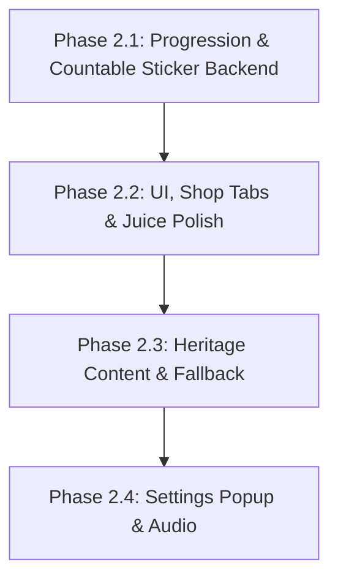

# Quy Hoach Thiet Ke Phase 2: Cozy Polish & Heritage Progression

> **Tai lieu Quy hoach Thiet ke (Technical Design Plan) - Review**
> **Du an:** Cozy Life Sim
> **Ngay thiet ke:** 2026-05-29
> **Trang thai:** Dang danh gia (Draft / Review)
> **Ngon ngu:** Tieng Viet khong dau (Triet tieu hoan toan mojibake)

---

## I. Phan Ra Va Thu Tu Thuc Thi Moi (Phase Dependencies Reordered)

De giai quyet triet de viec Phase UI phu thuoc vao Data Model moi, thu tu thuc thi cac Phase duoc sap xep lai nhu sau:



| Phase | Output Plan File | Task ID Prefix | Muc Tieu & Acceptance Criteria (Tieu Chi Nghiem Thu) |
| :--- | :--- | :--- | :--- |
| **Phase 2.1** | `2026-05-29-progression-countable-backend.md` | `P2.1` | **Muc tieu:** SaveData level/XP, StickerOwned model, migration an toan, unique placement ID, IProgressionService.<br>**Acceptance:** Chuyen doi save cu sang save moi an toan; Unit test validated. |
| **Phase 2.2** | `2026-05-29-ui-juice-polish.md` | `P2.2` | **Muc tieu:** Phan tab Shop, Sticker Tray cuon ngang hien thi count, DOTween bay xu, Return/Remove UX.<br>**Acceptance:** Shop chuyen tab muot ma; Tray cuon ngang hien thi dung count; Thu hoi sticker duoc. |
| **Phase 2.3** | `2026-05-29-heritage-content-fallback.md` | `P2.3` | **Muc tieu:** Bo sung data hoai niem Viet Nam that; Flat Fallback ve bang code.<br>**Acceptance:** Tu dong ve Flat color + Shadow + Outline khi thieu Art. |
| **Phase 2.4** | `2026-05-29-settings-audio.md` | `P2.4` | **Muc tieu:** Settings Popup (Audio Toggles, Player Profile), AudioService.<br>**Acceptance:** Toggle luu PlayerPrefs; Khong co nut Reset Progress. |

---

## II. Giai Quyet Cac Bai Toan Ky Thuat Cot Loi (Technical Architecture)

### 2.1. Di Dan Du Lieu Cu & Tranh Loi "Refill" Sticker - [P1]
*   **Vi tri xu ly**: Trong ham `NormalizeSaveData()` cua `SaveService.cs`.
*   **Quy tac di dan (Migration & Refill Guard)**:
    *   Kiem tra neu list `StickerOwned` chua duoc khoi tao hoac hoan toan rong -> Thuc hien khoi tao list moi.
    *   **Default Stickers (ID 1, 2)**: Chi gan `Count = 99` **duy nhat mot lan** luc migrate save cu hoac tao save hoan toan moi. Neu list `StickerOwned` da co san phan tu cho ID 1 va 2, he thong **tuyet doi khong** ghi de hay nạp lai ve 99 khi chay Normalize sau do.
    *   **UnlockedStickerIds cu**: Neu list cu co chua ID 3 (sticker cao cap da unlock truoc do), migrate sang `StickerOwned` moi voi `Count = 1`.
    *   **PlacedStickers hien co**: Cac sticker da dan tren sach truoc do van duoc giu nguyen ven vi no su dung toa do doc lap. So luong tren khay chi la so luong kha dung con lai trong kho de tranh bi am.
*   **Transition Rule cho UnlockedStickerIds cu**:
    *   List `UnlockedStickerIds` se duoc danh dau `[System.Obsolete]` va **loai bo hoan toan** khoi codebase ngay trong Phase 2.1.
    *   Toan bo cac service/presenter (`IShopService`, `ShopService`, `ShopPresenter`, `ShopPopup`, `StickerBook`) se chuyen sang dung duy nhat truong du lieu `StickerOwned` moi thong qua `IInventoryService` de tranh tinh trang mixed truth sources.

### 2.2. Dinh Danh Duy Nhat Cho Sticker Dan (Unique Placement Identity) - [P1]
De tranh viec float-compare bi loi hoac khong phan biet duoc khi nguoi choi dan nhieu sticker giong het nhau tren cung mot trang:
*   **Cap nhat model StickerPlacedData**:
    ```csharp
    [System.Runtime.InteropServices.StructLayout(System.Runtime.InteropServices.LayoutKind.Sequential, Pack = 1)]
    public struct StickerPlacedData
    {
        public int StickerId;
        public int PageIndex;
        public float PositionX;
        public float PositionY;
        public float Scale;
        public float Rotation;
        // Bổ sung truong dinh danh duy nhat:
        [System.Runtime.InteropServices.MarshalAs(System.Runtime.InteropServices.UnmanagedType.ByValTStr, SizeConst = 36)]
        public string PlacementId; 
    }
    ```
*   Khi sticker duoc dan thanh cong, he thong tu dong sinh mot chuoi GUID duy nhat: `string placementId = System.Guid.NewGuid().ToString();`.
*   Khi thu hoi, Presenter/Service se truyen chinh xac `PlacementId` nay de xoa an toan va khong bi nham lan.

### 2.3. Quy Trinh Thu Hoi Sticker & UX Tuong Tac - [P2]
*   **UX Tuong tac**:
    *   Nguoi choi nhap vao sticker da dan tren trang -> Kich hoat Edit Mode (Sticker lac lu nhe).
    *   Hien thi nut **"Thu hoi" (Return to Tray)** hinh thung rac nho/icon mui ten o goc tren.
    *   Nguoi choi click nut "Thu hoi" -> Thuc hien quy trinh thu hoi.
*   **Tinh Nguyen Tu (Atomicity) cua Placement & Return**:
    *   **Khi Dan**:
        1. Kiem tra `GetStickerCount(stickerId) > 0`. Neu dung, thuc hien dan.
        2. Sinh chuoi `PlacementId` moi va them vao `IMemoryService`.
        3. Tru count trong `IInventoryService` bang `ConsumeSticker(stickerId)`.
        4. Thuc hien `SaveService.Save()`.
        5. *Rollback neu loi*: Neu `Save()` bi throw exception (loi file, mat dien), he thong thuc hien rollback lap tuc: xoa sticker khoi `IMemoryService` va cong lai count vao kho truoc khi thong bao loi cho nguoi choi.
    *   **Khi Thu hoi**:
        1. Xoa `StickerPlacedData` khoi `IMemoryService` theo dung `PlacementId`.
        2. Cong lai count trong `IInventoryService` bang `AddStickerCount(stickerId, 1)`.
        3. Thuc hien `SaveService.Save()`.
        4. *Rollback neu loi*: Neu `Save()` that bai, thuc hien rollback: add lai sticker vao list dandan cua `IMemoryService` va tru di count trong kho.

### 2.4. Phân Dinh API Kho Sticker (Sticker Inventory API) - [P2]
Toan bo Sticker Inventory se do **`IInventoryService` va `InventoryService`** doc quyen quan ly de giu kien truc mach lac:
*   **Sticker API in IInventoryService**:
    *   `int GetStickerCount(int stickerId);`
    *   `void AddStickerCount(int stickerId, int amount);`
    *   `bool ConsumeSticker(int stickerId);`
    *   `event Action<int, int> OnStickerCountChanged;` (stickerId, newCount)
*   `IShopService` se chi goi `IInventoryService.AddStickerCount(stickerId, 1)` khi giao dich mua sticker cao cap trong Shop thanh cong.

### 2.5. Progression Service & Quest Idempotency - [P2]
*   **Progression Service**: Tao rieng `IProgressionService.cs` va `ProgressionService.cs` (DI registered) de quan ly thong tin `PlayerLevel`, `PlayerXP` va logic Level Up.
*   **Quest Reward & Active Quest Clean Up**:
    *   Khi Quest dat muc tieu -> Chuyen ID vao `CompletedQuestIds`, dong thoi **xoa phan tu tuong ung khoi list `ActiveQuestProgress`** de don dep sach se du lieu.
    *   Goi `IInventoryService.AddCoins()` va `IProgressionService.AddXP()`, sau do `Save()`. Triet tieu hoan toan viec tinh toan hay nhan thuong trung lap khi reload.

### 2.6. Vi Tri Cua Flag `ForceFlatUI` - [P3]
*   Flag `ForceFlatUI` duoc dinh nghia trong ScriptableObject `UIStyleConfig.cs`:
    `public bool ForceFlatUI = false;`
*   Va mot static debug hook trong `CozyProceduralUI.cs`:
    `public static bool ForceFlatUIDebug = false;` de test nhanh.

---

## III. Kich Ban Kiem Thu & Xac Minh Chi Tiet (Verification Checklist)

1.  **Save Migration Test (Kiem tra di dan save cu)**:
    *   Ghi de file save cu chi chua `UnlockedStickerIds`. Nap game va verify list `StickerOwned` moi tu dong sinh ra, default sticker 1 va 2 co `Count = 99`, sticker 3 co `Count = 1`.
    *   Verify viec normalize sau do **khong** refill lai ve 99 neu so luong hien tai khac 99.
2.  **Sticker Consumable Loop Test (Kiem tra vong lap sticker tieu hao)**:
    *   Mua 2 Sticker ID 3 trong Shop -> Khay Sticker Tray hien thi `x2`.
    *   Keo 1 Sticker dan len trang sach -> Verify so luong trong khay giam con `x1`.
    *   Nhan nut "Thu hoi" -> Verify sticker bi xoa khoi trang va khay sticker xuat hien lai voi so luong `x2`.
    *   Kiem tra tinh nguyen tu: Gia lap loi khi `Save()`, verify he thong thuc hien rollback count va vi tri dandan dung nhu cu.
3.  **Progression & Level Lock Test (Kiem tra thang cap va khoa Shop)**:
    *   Hoan thanh Quest -> Verify nhan XP chinh xac, tang level khi vuot nguong.
    *   Kiem tra Shop: Cac san pham khoa cap lap tuc mo khoa khi PlayerLevel dat yeu cau.
4.  **Procedural Flat Fallback Test (Kiem tra ve Flat khi thieu Art)**:
    *   Bat `ForceFlatUIDebug = true` -> Mo Shop -> Verify visual tu dong ve Flat color + Shadow + Outline tinh te, khong crash.
