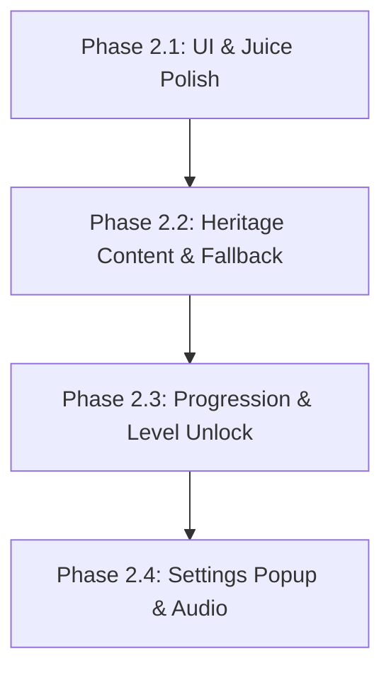

# Thiet Ke Ky Thuat Phase 2: Cozy Polish & Heritage Progression

> **Tai lieu Thiet ke Ky thuat (Technical Design Document) - Ban Thao / Review**
> **Du an:** Cozy Life Sim
> **Ngay thiet ke:** 2026-05-29
> **Trang thai:** Dang danh gia (Draft / Review)

---

## I. Phân rã Kế hoạch (Bite-sized Plans Split)

Để đảm bảo chất lượng kiểm thử và giảm thiểu rủi ro tích hợp, toàn bộ Phase 2 được phân rã thành 4 kế hoạch thực thi độc lập, triển khai tuần tự:



1.  **Phase 2.1: UI & Juice Polish**: Phân tab giao diện Shop, khay Sticker cuộn ngang và hiệu ứng bay tiền xu.
2.  **Phase 2.2: Heritage Content & Fallback**: Thiết lập bộ dữ liệu thật hoài niệm (tiếng Việt chuẩn UTF-8) và cơ chế Flat UI Fallback vẽ hình học trơn khi thiếu Art.
3.  **Phase 2.3: Progression & Level Unlock**: Tích hợp PlayerLevel/XP, thăng cấp từ Quest và khóa sản phẩm trong Shop theo cấp độ yêu cầu.
4.  **Phase 2.4: Settings Popup & Audio**: Xây dựng Settings Popup đa năng không có Reset Progress, điều khiển Audio FX/BGM.

---

## II. Chi tiết Thiết kế Kỹ thuật (Giai đoạn 2.1 & 2.2)

### 2.1. Phân hệ UI Polish & Juiciness (Phase 2.1)
*   **Shop phân tab**: Shop chia thành 3 tab (Seeds / Crops / Stickers) sử dụng thanh chọn Toggle.
*   **Khay Sticker cuộn ngang**: Refactor Sticker Book tray thành khay trượt ngang mượt mà, gom nhóm sticker cùng loại và hiển thị số lượng.
*   **DOTween Juiciness**: 
    *   Sử dụng `DOPunchScale` cho panel khi giao dịch thành công.
    *   Hiệu ứng bay xu (`Coin Splash`): Instantiate các coin prefab nhỏ, dùng `DOPath` bay dạng vòng cung từ card sản phẩm về phía hòm xu, sau đó tự hủy và nảy nhẹ text hiển thị Coin.

### 2.2. Dữ liệu Hoài niệm & Hỗ trợ Số lượng Sticker (Phase 2.2)

#### 2.2.1. Giải quyết Bài toán Số lượng Sticker (Countable Stickers)
Để hỗ trợ hiển thị số lượng sticker sở hữu (`x3`, `x5`) như yêu cầu UX, hệ thống thay đổi từ cơ chế unlock độc bản (boolean) sang cơ chế **Sticker tiêu hao (Consumable/Countable)**:

*   **Cấu trúc dữ liệu mới trong SaveData**:
    ```csharp
    [System.Serializable]
    public class StickerInventory
    {
        public int StickerId;
        public int Count;
    }
    // Trong SaveData:
    public List<StickerInventory> StickerOwned = new List<StickerInventory>();
    ```
*   **Quy tắc giao dịch**:
    *   Mua sticker ở Shop -> Tăng `Count` của `StickerId` tương ứng lên 1 -> Lưu save.
    *   Kéo sticker ra trang sách dán -> Giảm `Count` đi 1. Nếu `Count == 0`, ẩn sticker khỏi khay.
    *   Thu hồi sticker từ trang sách về khay -> Xóa `StickerPlacedData` khỏi danh sách dán, đồng thời tăng `Count` trong khay lên 1.

#### 2.2.2. Cơ chế Flat Fallback tinh giản
Không sử dụng Shader phức tạp hoặc tạo texture động để tránh rác GC:
*   Nếu phát hiện missing sprite (`null`), UI sử dụng màu phẳng (Flat Color) kết hợp trực tiếp với component **`Shadow`** và **`Outline`** mặc định của Unity UI để tạo hiệu ứng phẳng tinh tế (Flat Neumorphism) sắc nét.

---

## III. Chi tiết Phân hệ Progression & Settings (Phase 2.3 & 2.4)

### 3.1. Progression & Level Locks (Phase 2.3)
*   **SaveData**: Bổ sung `PlayerLevel` (mặc định = 1), `PlayerXP` (mặc định = 0).
*   **Schema mở rộng**:
    *   `CropTemplate.cs`, `StickerTemplate.cs`, `AnimalTemplate.cs`: Thêm thuộc tính `public int RequiredLevel = 1;`
    *   `QuestTemplate.cs`: Thêm thuộc tính `public int RewardXP = 20;`
*   Hoàn thành Quest -> Gọi `_inventoryService.AddXP(quest.RewardXP)` -> Kiểm tra thăng cấp -> Kích hoạt Level Up UI.

### 3.2. Settings Popup & Audio (Phase 2.4)
*   Settings Popup gồm Audio Toggles (SFX / Music) lưu qua `PlayerPrefs` và thẻ hồ sơ người chơi (Cấp độ, XP, và Mocked Player ID).
*   **Tuyệt đối không có nút Reset Progress** để bảo toàn dữ liệu liên tục của người chơi cho định hướng Online tương lai.

---

## IV. Kịch bản Kiểm thử & Xác minh (Verification Checklist)

Để đảm bảo tính ổn định tuyệt đối trước khi kết thúc phase, toàn bộ hệ thống phải vượt qua kịch bản kiểm thử sau:

1.  **Logic Verification Tests (`CozyLifeSimValidation.cs`)**:
    *   *Test 11.10 (XP & Level Up)*: Xác nhận cộng XP từ hoàn thành Quest nâng cấp PlayerLevel chính xác, lưu/tải bền vững.
    *   *Test 11.11 (Sticker Countable)*: Kiểm tra mua sticker ở shop tăng số lượng, dán sticker giảm số lượng, thu hồi sticker khôi phục số lượng chính xác 100%.
2.  **Scene Validation (`CozyLifeSimSceneGameplayValidation.cs`)**:
    *   Xác nhận các tab trong Shop và khay Sticker cuộn ngang có đầy đủ thành phần cấu trúc và các tham chiếu Script hoạt động bình thường.
3.  **Play Mode Runtime Loop Integration**:
    *   Mô phỏng chuỗi: Trồng cây -> Thu hoạch -> Bán lấy Coin -> Hoàn thành Quest nhận XP thăng cấp -> Mở khóa và mua sticker cấp cao hơn ở Shop -> Kéo dán sticker lên sách -> Kiểm tra số lượng trong khay giảm 1 -> Thu hồi sticker -> Kiểm tra số lượng tăng 1 -> Dữ liệu lưu an toàn qua PlayerPrefs.
4.  **Save Migration & Compatibility Test**:
    *   Nạp thử file save cũ (không có trường `PlayerLevel`, `PlayerXP`, `StickerOwned`). Xác nhận hệ thống `NormalizeSaveData()` tự động điền các trường mặc định an toàn mà không làm crash game.
5.  **Missing Asset Fallback Test**:
    *   Chạy game ở chế độ ép cờ `ForceFlatUI = true` (không có art package). Xác nhận UI tự chuyển sang màu phẳng + Outline mượt mà, không có lỗi `NullReferenceException` nào trong Console.
