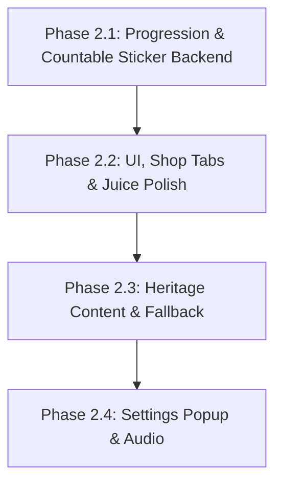

# Quy Hoach Thiet Ke Phase 2: Cozy Polish & Heritage Progression

> **Tai lieu Quy hoach Thiet ke (Technical Design Plan) - Review**
> **Du an:** Cozy Life Sim
> **Ngay thiet ke:** 2026-05-29
> **Trang thai:** Dang danh gia (Draft / Review)
> **Ngon ngu:** Tieng Viet khong dau (Triet tieu hoan toan mojibake)

---

## I. Phan Ra Va Thu Tu Thuc Thi Moi (Phase Dependencies Reordered)

De giai quyet triet de viec Phase UI phu thuoc vao Data Model moi, thu tu thuc thi cac Phase duoc sap xep lai nhu sau:



| Phase | Output Plan File | Task ID Prefix | Muc Tieu & Acceptance Criteria (Tieu Chi Nghiem Thu) |
| :--- | :--- | :--- | :--- |
| **Phase 2.1** | `2026-05-29-progression-countable-backend.md` | `P2.1` | **Muc tieu:** SaveData level/XP, StickerOwned model, migration an toan voi co HasMigratedStickerOwned, unique serializable placement ID, IProgressionService, non-saving API va rollback.<br>**Acceptance:** Chuyen doi save cu sang save moi an toan; Unit test validated. |
| **Phase 2.2** | `2026-05-29-ui-juice-polish.md` | `P2.2` | **Muc tieu:** Phan tab Shop, Sticker Tray cuon ngang hien thi count, DOTween bay xu, Return/Remove UX.<br>**Acceptance:** Shop chuyen tab muot ma; Tray cuon ngang hien thi dung count; Thu hoi sticker duoc. |
| **Phase 2.3** | `2026-05-29-heritage-content-fallback.md` | `P2.3` | **Muc tieu:** Bo sung data hoai niem Viet Nam that; Flat Fallback ve bang code.<br>**Acceptance:** Tu dong ve Flat color + Shadow + Outline khi thieu Art. |
| **Phase 2.4** | `2026-05-29-settings-audio.md` | `P2.4` | **Muc tieu:** Settings Popup (Audio Toggles, Player Profile), AudioService.<br>**Acceptance:** Toggle luu PlayerPrefs; Khong co nut Reset Progress. |

---

## II. Giai Quyet Cac Bai Toan Ky Thuat Cot Loi (Technical Architecture)

### 2.1. Di Dan Du Lieu Cu & Refill Guard Chuan Xac - [P1]
*   **Vi tri xu ly**: Trong ham `NormalizeSaveData()` cua `SaveService.cs`.
*   **Bo sung Migration Marker trong SaveData.cs**:
    `public bool HasMigratedStickerOwned = false;`
*   **Quy tac di dan (Migration & Refill Guard)**:
    *   Ham `NormalizeSaveData()` kiem tra neu `!HasMigratedStickerOwned`:
        1. **Partial-upgrade check**: Kiem tra truoc neu `ActiveSave.StickerOwned != null && ActiveSave.StickerOwned.Count > 0` (save co san tu build trung gian hoac dev). Neu dung, lap tuc gan `HasMigratedStickerOwned = true` va bo qua toan bo buoc duoi de bao toan tuyet doi du lieu thuc te.
        2. Khoi tao list `StickerOwned` moi.
        3. **Default Stickers (ID 1, 2)**: Gan `Count = 99` cho ID 1 va 2 trong `StickerOwned`. Vi tri nay chi chay duy nhat mot lan.
        4. **Sticker Dac Biet da unlock (ID 3)**: Check tu list cu `UnlockedStickerIds` (van duoc giu lai trong class `SaveData.cs` de tuong thich nguoc deserialization nhung danh dau `[System.Obsolete]`). Neu ID 3 ton tai, migrate sang `StickerOwned` voi `Count = 1`. Sau do, goi `UnlockedStickerIds.Clear()` de don dep file save.
        5. Gan `HasMigratedStickerOwned = true` va goi `Save()`.
    *   Neu `HasMigratedStickerOwned == true`, he thong **tuyet doi bo qua** moi buoc khoi tao hoac refill de tranh viec tu dong nap lai sticker khi so luong da ve 0 do tieu thu.

### 2.2. Dinh Danh PlacedStickerId Serializable & StructLayout - [P1] & [P2]
*   **Loai bo hoan toan** thuoc tinh `[StructLayout(LayoutKind.Sequential, Pack = 1)]` khoi `StickerPlacedData` vi no chua kieu tham chieu string PlacementId va khong con la struct thuan C# nua.
*   Bieu dien sticker da dan tren sach bang truong chuoi `PlacementId` thong thuong duoc serializable ma khong can bat ky thuoc tinh marshal interop phuc tap nao:
    ```csharp
    [System.Serializable]
    public struct StickerPlacedData
    {
        public int StickerId;
        public int PageIndex;
        public float PositionX;
        public float PositionY;
        public float Scale;
        public float Rotation;
        public string PlacementId; // UUID chuoi duy nhat duoc sinh ra tu System.Guid.NewGuid().ToString() luc dan
    }
    ```

### 2.3. Tinh Nguyen Tu Giao Dich (Transaction Contract & Non-saving API) - [P1]
Cac phuong thuc thay doi du lieu non-saving duoc khai bao truc tiep trong **Interface Contract** `IInventoryService` va `IMemoryService` de `StickerBookPresenter` hoac `ShopService` co the dieu phoi an toan qua interface:
*   **Non-saving API in IInventoryService**:
    *   `void AddStickerCountNonSaving(int stickerId, int amount);`
    *   `bool ConsumeStickerNonSaving(int stickerId);`
    *   `void AddCoinsNonSaving(int amount);`
    *   `bool ConsumeCoinsNonSaving(int amount);`
*   **Non-saving API in IMemoryService**:
    *   `void AddPlacedStickerNonSaving(StickerPlacedData data);`
    *   `void RemovePlacedStickerNonSaving(string placementId);`
*   **Quy trinh dieu phoi nguyen tu (Orchestration & Rollback)**:
    *   Toan bo giao dich duoc dieu phoi tap trung:
        1. Dan sticker: Goi `ConsumeStickerNonSaving(stickerId)` va `AddPlacedStickerNonSaving(data)`. Goi `SaveService.Save()`. Rollback nguoc lai trong bo nho neu loi.
        2. Thu hoi sticker: Goi `RemovePlacedStickerNonSaving(placementId)` va `AddStickerCountNonSaving(stickerId, 1)`. Goi `SaveService.Save()`. Rollback nguoc lai trong bo nho neu loi.
        3. Mua sticker trong Shop: Goi `ConsumeCoinsNonSaving(price)` va `AddStickerCountNonSaving(stickerId, 1)`. Goi `SaveService.Save()`. Rollback (`AddCoinsNonSaving` + `ConsumeStickerNonSaving`) nguoc lai trong bo nho neu loi.

### 2.4. Save Failure Hook phuc vu Automation Test - [P1] & [P2]
De kiem thu hoan hao tinh nguyen tu va rollback trong unit test `Test 11.11` ma khong lam o nhiem runtime contract thuc te:
*   Su dung chi thi tien xu ly **`#if UNITY_EDITOR`** bao boc thuoc tinh kiem thu trong interface `ISaveService` va `SaveService.cs`:
    ```csharp
    #if UNITY_EDITOR
    public bool ForceSaveFailure { get; set; }
    #endif
    ```
*   Trong `Save()` cua `SaveService.cs`:
    ```csharp
    #if UNITY_EDITOR
    if (ForceSaveFailure)
    {
        throw new System.Exception("Simulated Save Failure for Atomicity Testing");
    }
    #endif
    ```
*   Trong unit test (chay trong editor context): Set `ForceSaveFailure = true`, goi giao dich dandan/thu hoi/mua sticker, verify nem Exception, va verify toan bo so luong/PlacedStickers giu nguyen 100% nho co che rollback trong bo nho, sau do reset `ForceSaveFailure = false`.

### 2.5. Phan Dinh API Kho Sticker (Sticker Inventory API) - [P2]
Toan bo kho sticker duoc quan ly tap trung boi **`IInventoryService` va `InventoryService`**:
*   `int GetStickerCount(int stickerId);`
*   `void AddStickerCount(int stickerId, int amount);` (co bien the non-saving in interface)
*   `bool ConsumeSticker(int stickerId);` (co bien the non-saving in interface)
*   `event Action<int, int> OnStickerCountChanged;` (stickerId, newCount)

### 2.6. Shop API, TryBuySticker Guards & Level Locks - [P2]
*   `IShopService` giu nguyen API `TryBuySticker(int stickerId)` nhung loai bo hoan toan `IsStickerUnlocked`.
*   **Cac guard an toan va transaction nguyen tu trong TryBuySticker**:
    1.  **Template check**: Lay template tu `StickerDatabase.GetSticker(stickerId)`. Neu null -> return false.
    2.  **Level Lock check**: Kiem tra neu `IProgressionService.PlayerLevel < template.RequiredLevel` -> return false.
    3.  **BuyPrice check**: Kiem tra neu `template.BuyPrice <= 0` -> return false.
    4.  **Balance check**: Kiem tra neu `IInventoryService.Coins < template.BuyPrice` -> return false.
    5.  **Deduct Coins & Add Count (Non-saving)**: Goi `IInventoryService.ConsumeCoinsNonSaving(template.BuyPrice)` va `IInventoryService.AddStickerCountNonSaving(stickerId, 1)`.
    6.  **Persist & Rollback**: Goi `SaveService.Save()`. Neu `Save()` loi -> goi `AddCoinsNonSaving` va `ConsumeStickerNonSaving` de khoi phuc bo nho truoc khi throw; neu thanh cong -> ban `OnShopTransactionSuccess`.
*   **ShopPopup button state**:
    *   *Uu tien 1 (Level Lock)*: Neu `PlayerLevel < RequiredLevel` -> Hien thi text do `Can cap X`.
    *   *Uu tien 2 (Affordability)*: Neu `Coins < BuyPrice` -> Hien thi text do `Thieu Coin`.
    *   *Hien thi card*: Luon hien thi button `Mua (+1)` kem gia, kem theo text hien thi ton kho `So luong: X` ben canh san pham sticker.

### 2.7. Level Lock & Reward XP Schema - [P2]
*   `CropTemplate.cs`: `public int RequiredLevel;`
*   `StickerTemplate.cs`: `public int RequiredLevel;`
*   `AnimalTemplate.cs`: `public int RequiredLevel;`
*   `QuestTemplate.cs`: `public int RewardXP;`

### 2.8. Quest Reward & Active Quest Clean Up - [P2]
*   Khi Quest dat muc tieu -> Chuyen ID vao `CompletedQuestIds`, dong thoi **xoa phan tu tuong ung khoi list `ActiveQuestProgress`** trong file save de don dep sach se.

### 2.9. Vi Tri Flag `ForceFlatUI` - [P3]
*   Dinh nghia `public bool ForceFlatUI = false;` trong `UIStyleConfig.cs` va static hook `public static bool ForceFlatUIDebug = false;` trong `CozyProceduralUI.cs`.

---

## III. Kich Ban Kiem Thu & Xac Minh Chi Tiet (Verification Checklist)

1.  **Save Migration Test (Kiem tra di dan save cu)**:
    *   Ghi de file save cu chua `UnlockedStickerIds`. Verify list `StickerOwned` moi tu dong sinh, default sticker 1 va 2 co `Count = 99`, sticker 3 co `Count = 1`.
    *   Kiem tra Normalize sau do: Verify **khong** refill lai ve 99 neu so luong hien tai khac 99 vi co `HasMigratedStickerOwned` da duoc set.
    *   *Partial-upgrade case*: Ghi de save da co StickerOwned nhung `HasMigratedStickerOwned = false`. Verify he thong tu dong set marker true va **bo qua** gan lai count.
2.  **Sticker Consumable & Atomicity Test (Kiem tra tinh nguyen tu)**:
    *   Mua sticker ID 3 -> Tray tang count.
    *   Keo dan sticker -> Count giam 1. Thu hoi sticker -> Count tang 1.
    *   Gia lap loi: Set `ForceSaveFailure = true` (Editor context), goi giao dich dan/thu hoi/mua sticker, verify nem Exception va he thong thuc hien rollback dung nhu cu (kho va placed data khong bi lech).
3.  **Progression & Level Lock Test**:
    *   Quest hoan thanh -> Nhan XP -> Tang Level -> Shop mo khoa dung cap.
4.  **Procedural Flat Fallback Test**:
    *   Bat `ForceFlatUIDebug = true` -> Verify visual tu dong ve Flat color + Shadow + Outline tinh te, khong crash.
