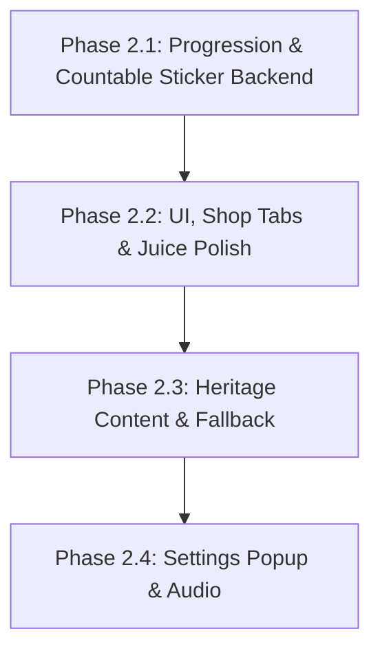

# Quy Hoach Thiet Ke Phase 2: Cozy Polish & Heritage Progression

> **Tai lieu Quy hoach Thiet ke (Technical Design Plan) - Review**
> **Du an:** Cozy Life Sim
> **Ngay thiet ke:** 2026-05-29
> **Trang thai:** Dang danh gia (Draft / Review)
> **Ngon ngu:** Tieng Viet khong dau (Triet tieu hoan toan mojibake)

---

## I. Phan Ra Va Thu Tu Thuc Thi Moi (Phase Dependencies Reordered)

De giai quyet triet de viec Phase UI phu thuoc vao Data Model moi, cac sub-plan con phat sinh trong phien hom nay (2026-05-30) duoc sap xep va dat ten nhat quan nhu sau:



| Phase | Output Plan File | Task ID Prefix | Muc Tieu & Acceptance Criteria (Tieu Chi Nghiem Thu) |
| :--- | :--- | :--- | :--- |
| **Phase 2.1** | `2026-05-30-progression-countable-backend.md` | `P2.1` | **Muc tieu:** SaveData level/XP, StickerOwned model, migration an toan voi co HasMigratedStickerOwned, unique serializable placement ID, IProgressionService, non-saving API va rollback.<br>**Acceptance:** Chuyen doi save cu sang save moi an toan; Unit test validated. |
| **Phase 2.2** | `2026-05-30-ui-juice-polish.md` | `P2.2` | **Muc tieu:** Phan tab Shop, Sticker Tray cuon ngang hien thi count, DOTween bay xu, Return/Remove UX.<br>**Acceptance:** Shop chuyen tab muot ma; Tray cuon ngang hien thi dung count; Thu hoi sticker duoc. |
| **Phase 2.3** | `2026-05-30-heritage-content-fallback.md` | `P2.3` | **Muc tieu:** Bo sung data hoai niem Viet Nam that; Flat Fallback ve bang code.<br>**Acceptance:** Tu dong ve Flat color + Shadow + Outline khi thieu Art. |
| **Phase 2.4** | `2026-05-30-settings-audio.md` | `P2.4` | **Muc tieu:** Settings Popup (Audio Toggles, Player Profile), AudioService.<br>**Acceptance:** Toggle luu PlayerPrefs; Khong co nut Reset Progress. |

---

## II. Giai Quyet Cac Bai Toan Ky Thuat Cot Loi (Technical Architecture)

### 2.1. Di Dan Du Lieu Cu, Merge An Toan & Null-Safe - [P1], [P2] & [P3]
*   **Vi tri xu ly**: Trong ham `NormalizeSaveData()` cua `SaveService.cs`.
*   **Bo sung Migration Marker trong SaveData.cs**:
    `public bool HasMigratedStickerOwned = false;`
*   **Quy tac di dan (Migration & Refill Guard & PlacementId Backfill)**:
    *   **Dirty Flag de luu Save**: Su dung mot bien `bool isDirty = false;` xuyen suot qua trinh Normalize de theo doi cac thay doi can ghi file (ke ca khi chi backfill PlacementId hoac sua null list ma khong migrate inventory).
    *   **Invariant Null-Safety (Bat bien phi null luon luon chay)**:
        De ngan ngua triet de loi `NullReferenceException` neu save cu, save trung gian hoac save bi hong co `HasMigratedStickerOwned = true` nhung cac collection bi null, he thong luon kiem tra va khoi tao truoc khi chay cac logic khac:
        ```csharp
        if (ActiveSave.StickerOwned == null)
        {
            ActiveSave.StickerOwned = new List<StickerInventory>();
            isDirty = true;
        }
        if (ActiveSave.PlacedStickers == null)
        {
            ActiveSave.PlacedStickers = new List<StickerPlacedData>();
            isDirty = true;
        }
        if (ActiveSave.CompletedQuestIds == null)
        {
            ActiveSave.CompletedQuestIds = new List<int>();
            isDirty = true;
        }
        if (ActiveSave.ActiveQuestProgress == null)
        {
            ActiveSave.ActiveQuestProgress = new List<QuestProgressData>();
            isDirty = true;
        }
        ```
    *   **Logic Di Dan (Migration & Refill) duoc bao ve boi Marker**:
        Ham `NormalizeSaveData()` kiem tra neu `!HasMigratedStickerOwned`:
        1. **Gan default stickers**: Neu `ActiveSave.StickerOwned.Count == 0` (save moi hoan toan hoac save cu chua tung khoi tao countable sticker), tien hanh them default stickers ID 1 va 2 voi `Count = 99`. Chi thuc hien viec gan default nay 1 lan duy nhat luc migrate/new save. Neu save da co san du lieu, **tuyet doi khong** refill ve 99 khi Normalize chay sau do de bao toan so luong thuc te.
        2. **Merge legacy an toan (Null-Safe)**: Luon luon thuc hien viec merge `UnlockedStickerIds` cu sang `StickerOwned` moi neu `UnlockedStickerIds` khong bi null:
           ```csharp
           if (ActiveSave.UnlockedStickerIds != null)
           {
               foreach (var oldId in ActiveSave.UnlockedStickerIds)
               {
                   if (!ActiveSave.StickerOwned.Exists(x => x.StickerId == oldId))
                   {
                       ActiveSave.StickerOwned.Add(new StickerInventory(oldId, 1));
                   }
               }
               ActiveSave.UnlockedStickerIds.Clear(); // Don dep vung nho cu
           }
           ```
        3. **Danh dau hoan thanh di dan**: Gan `HasMigratedStickerOwned = true` va `isDirty = true;`.
    *   **Backfill PlacementId cho PlacedStickers cu (Null-Safe & Struct-Safe)**:
        De dam bao cac sticker da dan tu save cu co the thu hoi an toan bang UUID:
        Vi `StickerPlacedData` la **struct (value type)**, **tuyet doi khong dung foreach de thay doi gia tri** (se gay loi copy-by-value va khong persist). Bat buoc dung **indexed loop (vong lap for)**, lay phan tu ra sua roi gan nguoc lai:
        ```csharp
        for (int i = 0; i < ActiveSave.PlacedStickers.Count; i++)
        {
            var placed = ActiveSave.PlacedStickers[i];
            if (string.IsNullOrEmpty(placed.PlacementId))
            {
                placed.PlacementId = System.Guid.NewGuid().ToString();
                ActiveSave.PlacedStickers[i] = placed;
                isDirty = true; // Danh dau co thay doi de luu lai
            }
        }
        ```
    *   **Luu file neu thay doi**: Neu `isDirty == true`, goi `Save()` de ghi file len dia ngay lap tuc. Dieu nay bao dam cac GUID duoc backfill hoac inventory duoc di dan se duoc bao toan vinh vien ma khong bi mat khi tai lai.

### 2.2. Dinh Nghia Schema StickerOwned & PlacementId - [P1] & [P2]
*   **Loai bo hoan toan** thuoc tinh `[StructLayout(LayoutKind.Sequential, Pack = 1)]` khoi `StickerPlacedData` vi no chua kieu tham chieu string PlacementId.
*   **Khai bao struct/class moi**:
    ```csharp
    [System.Serializable]
    public class StickerInventory
    {
        public int StickerId;
        public int Count;

        public StickerInventory(int stickerId, int count)
        {
            StickerId = stickerId;
            Count = count;
        }
    }

    [System.Serializable]
    public struct StickerPlacedData
    {
        public int StickerId;
        public int PageIndex;
        public float PositionX;
        public float PositionY;
        public float Scale;
        public float Rotation;
        public string PlacementId; // UUID chuoi duy nhat duoc sinh ra tu System.Guid.NewGuid().ToString()

        // Constructor bat buoc dung khi tao moi, tu dong sinh GUID duy nhat de dam bao hop dong du lieu
        public StickerPlacedData(int stickerId, int pageIndex, float x, float y, float scale, float rotation)
        {
            StickerId = stickerId;
            PageIndex = pageIndex;
            PositionX = x;
            PositionY = y;
            Scale = scale;
            Rotation = rotation;
            PlacementId = System.Guid.NewGuid().ToString();
        }
    }
    ```
*   Trong class `SaveData.cs`, truong du lieu se duoc khai bao dung chuan:
    `public List<StickerInventory> StickerOwned = new List<StickerInventory>();`

### 2.3. Tinh Nguyen Tu Giao Dich Trong Bo Nho (Runtime State Atomicity & Non-saving API) - [P1] & [P2]
Muc tieu chinh cua he thong la **dam bao tinh nguyen tu trong bo nho (Runtime State Atomicity)** de RAM luon dong bo voi file save hien tai khi co loi xay ra.
Cac phuong thuc thay doi du lieu non-saving duoc khai bao truc tiep trong **Interface Contract** `IInventoryService` va `IMemoryService` de presenter hoac ShopService dieu phoi qua interface:
*   **Non-saving API in IInventoryService**:
    *   `void AddStickerCountNonSaving(int stickerId, int amount);`
    *   `bool ConsumeStickerNonSaving(int stickerId);` // Tra ve false neu khong du so luong
    *   `void AddCoinsNonSaving(int amount);`
    *   `bool ConsumeCoinsNonSaving(int amount);` // Tra ve false neu khong du coin
*   **Non-saving API in IMemoryService**:
    *   `StickerPlacedData AddPlacedStickerNonSaving(StickerPlacedData data);` // Thuc hien ADD thuan tuy (pure append) dua tren unique PlacementId. Phuong thuc nay luon thuc hien defensive validation: Neu data.PlacementId null hoac rong, hoac trung lap voi PlacementId cua bat ky sticker nao khac trong PlacedStickers, he thong tu dong sinh `Guid.NewGuid().ToString()` ghi de vao truoc khi add de dam bao an toan tuyet doi ke ca khi nguoi dung dung default struct. Tra ve struct StickerPlacedData da duoc chèn thuc te (bao gom GUID duy nhat thuc te da luu) de presenter co the nhan va su dung cho cac buoc dong bo hoac rollback sau nay.
    *   `bool TryRemovePlacedStickerNonSaving(string placementId, out StickerPlacedData removedData);` // Tra ve false neu khong tim thay sticker placement
*   **Quy trinh dieu phoi va dieu kien Abort/Rollback**:
    *   **Dan sticker**:
        1. Goi `ConsumeStickerNonSaving(stickerId)`. Neu ket qua la `false` -> **Dung giao dich ngay lap tuc va bao loi**, khong goi buoc tiep theo.
        2. Goi `data = AddPlacedStickerNonSaving(data);`. (Nhan lai struct StickerPlacedData da co PlacementId hop le sau defensive validation).
        3. Goi `SaveService.Save()`.
        4. *Rollback neu Save() loi*: Goi `AddStickerCountNonSaving(stickerId, 1)` va `TryRemovePlacedStickerNonSaving(data.PlacementId, out _)` de khoi phuc bo nho chinh xac theo dung PlacementId da luu o buoc 2.
    *   **Thu hoi sticker**:
        1. Goi `TryRemovePlacedStickerNonSaving(placementId, out var removedData)`. Neu ket qua la `false` -> **Dung giao dich ngay lap tuc va bao loi**, khong tiep tuc (ngan chan viec add nham count).
        2. Goi `AddStickerCountNonSaving(removedData.StickerId, 1)`.
        3. Goi `SaveService.Save()`.
        4. *Rollback neu Save() loi*: Goi `AddPlacedStickerNonSaving(removedData)` va `ConsumeStickerNonSaving(removedData.StickerId)`.
    *   **Mua sticker trong Shop**:
        1. Goi `ConsumeCoinsNonSaving(price)`. Neu `false` -> **Dung giao dich lap tuc**.
        2. Goi `AddStickerCountNonSaving(stickerId, 1)`.
        3. Goi `SaveService.Save()`.
        4. *Rollback neu Save() loi*: Goi `AddCoinsNonSaving(price)` va `ConsumeStickerNonSaving(stickerId)`.

### 2.4. Save Failure Hook phuc vu Automation Test - [P1] & [P2]
*   Su dung chi thi tien xu ly **`#if UNITY_EDITOR`** bao boc thuoc tinh kiem thu trong interface `ISaveService` va `SaveService.cs`:
    ```csharp
    #if UNITY_EDITOR
    public bool ForceSaveFailure { get; set; }
    #endif
    ```
*   Trong `Save()` cua `SaveService.cs`:
    ```csharp
    #if UNITY_EDITOR
    if (ForceSaveFailure)
    {
        throw new System.Exception("Simulated Save Failure for Atomicity Testing");
    }
    #endif
    ```

### 2.5. Phan Dinh API Kho Sticker (Sticker Inventory API) - [P2]
Toan bo kho sticker duoc quan ly tap trung boi **`IInventoryService` va `InventoryService`**:
*   `int GetStickerCount(int stickerId);`
*   `void AddStickerCount(int stickerId, int amount);`
*   `bool ConsumeSticker(int stickerId);`
*   `event Action<int, int> OnStickerCountChanged;`

### 2.6. Shop API, TryBuySticker Guards & Level Locks - [P2]
*   `IShopService` giu nguyen API `TryBuySticker(int stickerId)` nhung loai bo hoan toan `IsStickerUnlocked`.
*   **Cac guard an toan va transaction nguyen tu trong TryBuySticker**:
    1.  **Template check**: Lay template tu `StickerDatabase.GetSticker(stickerId)`. Neu null -> return false.
    2.  **Level Lock check**: Kiem tra neu `IProgressionService.PlayerLevel < template.RequiredLevel` -> return false.
    3.  **BuyPrice check**: Kiem tra neu `template.BuyPrice <= 0` -> return false.
    4.  **Deduct Coins & Add Count (Non-saving)**: Goi `IInventoryService.ConsumeCoinsNonSaving(template.BuyPrice)`. Neu ket qua la `false` -> **Dung giao dich ngay lap tuc**.
    5.  Goi `IInventoryService.AddStickerCountNonSaving(stickerId, 1)`.
    6.  **Persist & Rollback**: Goi `SaveService.Save()`. Neu `Save()` loi -> goi `AddCoinsNonSaving` va `ConsumeStickerNonSaving` de khoi phuc bo nho; neu thanh cong -> ban `OnShopTransactionSuccess`.

### 2.7. Level Lock & Reward XP Schema - [P2]
*   `CropTemplate.cs`: `public int RequiredLevel;`
*   `StickerTemplate.cs`: `public int RequiredLevel;`
*   `AnimalTemplate.cs`: `public int RequiredLevel;`
*   `QuestTemplate.cs`: `public int RewardXP;`

### 2.8. Quest Reward & Active Quest Clean Up - [P2]
*   Khi Quest dat muc tieu -> Chuyen ID vao `CompletedQuestIds`, dong thoi **xoa phan tu tuong ung khoi list `ActiveQuestProgress`** trong file save de don dep sach se.

### 2.9. Vi Tri Flag `ForceFlatUI` - [P3]
*   Dinh nghia `public bool ForceFlatUI = false;` trong `UIStyleConfig.cs` va static hook `public static bool ForceFlatUIDebug = false;` trong `CozyProceduralUI.cs`.

---

## III. Kich Ban Kiem Thu & Xac Minh Chi Tiet (Verification Checklist)

1.  **Save Migration Test (Kiem tra di dan save cu)**:
    *   Ghi de file save cu chua `UnlockedStickerIds`. Verify list `StickerOwned` moi tu dong sinh, default sticker 1 va 2 co `Count = 99`, sticker 3 co `Count = 1`.
    *   Verify viec backfill GUID an toan: Cac sticker da dan cu phai nhan duoc `PlacementId` GUID chuoi ngau nhien hop le, kiem tra thu hoi thanh cong 100% theo GUID moi.
    *   Kiem tra Normalize sau do: Verify **khong** refill lai ve 99 neu so luong hien tai khac 99 vi co `HasMigratedStickerOwned` da duoc set.
    *   *Partial-upgrade case*: Ghi de save da co StickerOwned nhung `HasMigratedStickerOwned = false` va co UnlockedStickerIds cu. Verify he thong tu dong set marker true, **bo qua** gan lai count default, nhung **van merge thanh cong** cac ID chua co (ID 3) vao StickerOwned voi `Count = 1`.
2.  **Sticker Consumable & Atomicity Test (Kiem tra tinh nguyen tu)**:
    *   Mua sticker ID 3 -> Tray tang count.
    *   Keo dan sticker -> Count giam 1. Thu hoi sticker -> Count tang 1.
    *   Gia lap loi: Set `ForceSaveFailure = true` (Editor context), goi giao dich dan/thu hoi/mua sticker, verify nem Exception va he thong thuc hien rollback dung nhu cu trong bo nho (kho va placed data khong bi lech).
    *   *Multiple Copies Test*: Dan 3 sticker cung ID 3 len cung 1 trang. Verify ca 3 sticker ton tai rieng biet (Pure Append), moi sticker co single unique GUID, co the thu hoi tung cai mot cach doc lap ma khong gay loi.
3.  **Progression & Level Lock Test**:
    *   Quest hoan thanh -> Nhan XP -> Tang Level -> Shop mo khoa dung cap.
4.  **Procedural Flat Fallback Test**:
    *   Bat `ForceFlatUIDebug = true` -> Verify visual tu dong ve Flat color + Shadow + Outline tinh te, khong crash.
