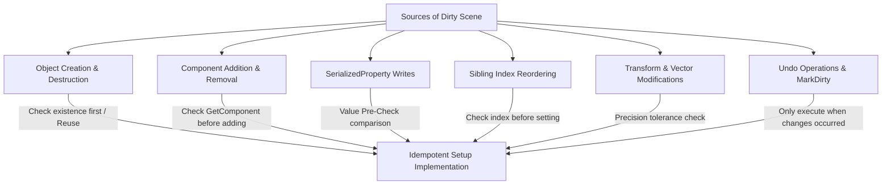

# Ke Hoach Trien Khai: Cozy Heritage, Idempotency Setup & Deep Validation

> **Tai lieu Ke hoach Trien khai (Implementation Plan)**<br>
> **Du an:** Cozy Life Sim<br>
> **Ngay thiet ke:** 2026-06-01<br>
> **Trang thai:** Cho Duyet (Pending Approval)<br>
> **Ngon ngu:** Tieng Viet khong dau (Dam bao triet tieu hoan toan mojibake va dong bo du lieu)

Kich ban nay vach ra phuong an chi tiet de trien khai 4 hang muc cong viec tiep theo tren repository hien tai, dam bao tinh on dinh tuyet doi cua Scene, dong bo du lieu hoai niem va kiem thu tich hop sau.

---

## I. Yeu Cau Danh Gia Tu Nguoi Dung (User Review Required)

> [!IMPORTANT]
> **Khong tao code moi cho Cozy Juice Polish:**
> Theo chi thi cua ban de tranh phinh to be mat ma nguon va compile/meta khong can thiet khi chua du tai nguyen am thanh, chung ta se **KHONG** tao bat ky file ma nguon runtime moi nao nhu `CozyJuiceDesign.cs` hay Interface code. Toan bo thiet ke Juice hoan toan duoc ghi nhan duoi dang tai lieu thiet ke chi tiet tai Muc II.4 trong file plan nay de danh cho cac buoc phat trien sau.
>
> **Quy tac an toan Unity .meta:**
> Khi tao file ma nguon moi `CozyProceduralUI.cs`, tuyet doi khong tu tao file `.meta` bang tay. Phai de Unity Editor tu dong compile va sinh file `.meta` tu nhien khi hoan tat de tranh gay hong tham chieu GUID.
> Sau khi cap nhat hay them moi bat ky script nao, phai doi Unity compile/import hoan toan tu dong, mo cua so Console hoac Editor log kiem tra ky de dam bao 100% khong co compiler errors nao roi moi duoc danh dau hoan thanh task.

---

## II. Chi Tiet Cac Thay Doi De Xuat (Proposed Changes)

### 1. Du Lieu Hoai Niem Viet Nam (Heritage Content)
Dua cac noi dung hoai niem Viet Nam vao he thong data-driven thong qua bootstrap du lieu tu dong, hoat dong tren ca be mat Sprite va che do Flat Fallback.

#### [VERIFY] [required-assets.md](file:///d:/soflware/Unity/Source/Cozy_Life_Sim/docs/plans/required-assets.md)
*   **Vi tri proposed**: Duyet va kiem tra danh sach tai nguyen hinh anh thuc te can thiet cho Sticker, Crop, Animal va Quest. Day la kho tai nguyen thong tin de ban thiet ke ve sau nay (da duoc tao san).

#### [MODIFY] [StickerDatabaseUtility.cs](file:///d:/soflware/Unity/Source/Cozy_Life_Sim/Assets/CozyLifeSim/Scripts/Editor/StickerDatabaseUtility.cs)
*   Bo sung 5 Sticker hoai niem Viet Nam vao qua trinh bootstrap du lieu bang cach dung `!database.Stickers.Exists(...)` de tranh trung lap:
    *   `StickerId 4`: **Xe Banh Mi** (BuyPrice: 60, ReqLevel: 1)
    *   `StickerId 5`: **Ly Nuoc Mia** (BuyPrice: 40, ReqLevel: 1)
    *   `StickerId 6`: **Chiec Non La** (BuyPrice: 50, ReqLevel: 2)
    *   `StickerId 7`: **Chiec Xich Lo** (BuyPrice: 120, ReqLevel: 3)
    *   `StickerId 8`: **Long Den Trung Thu** (BuyPrice: 80, ReqLevel: 2)
*   Anh xa cac Sticker moi ve cac mau sac nhan dien rieng biet de phuc vu cho render phang Flat Fallback.

#### [MODIFY] [CropDatabaseUtility.cs](file:///d:/soflware/Unity/Source/Cozy_Life_Sim/Assets/CozyLifeSim/Scripts/Editor/CropDatabaseUtility.cs)
*   Bo sung 3 loai nong san Viet Nam vao qua trinh bootstrap:
    *   `CropId 2`: **Cay Mia Ngot** (SeedPrice: 15, SellPrice: 35, Growth: 8s, ReqLevel: 1, Mau dac trung: Xanh la ma)
    *   `CropId 3`: **Lua Nuoc** (SeedPrice: 25, SellPrice: 60, Growth: 15s, ReqLevel: 2, Mau dac trung: Vang ong)
    *   `CropId 4`: **Hoa Sen** (SeedPrice: 50, SellPrice: 120, Growth: 25s, ReqLevel: 3, Mau dac trung: Hong sen)

#### [MODIFY] [AnimalDatabaseUtility.cs](file:///d:/soflware/Unity/Source/Cozy_Life_Sim/Assets/CozyLifeSim/Scripts/Editor/AnimalDatabaseUtility.cs)
*   Bo sung 2 con vat gan gui vao pen:
    *   `AnimalId 2`: **Meo Tam The** (ReqLevel: 1, PetReward: 5 coins, Scale: 1f)
    *   `AnimalId 3`: **Trau Nuoc** (ReqLevel: 3, PetReward: 15 coins, Scale: 1.25f, Mau dac trung: Xam den)

#### [MODIFY] [QuestEditorWindow.cs](file:///d:/soflware/Unity/Source/Cozy_Life_Sim/Assets/CozyLifeSim/Scripts/Editor/QuestEditorWindow.cs)
*   Day la cong cu chiu trach nhiem bootstrap du lieu Quest ban dau trong ham `LoadOrCreateDatabase()`.
*   Sua logic de kiem tra va tu dong bo sung 3 Quest hoai niem sau neu chua ton tai (`!_database.Quests.Exists(...)`), dong thoi luu tru an toan de giu nguyen cac quest nguoi dung da edit:
    *   `QuestId 2` (*"Huong Vi Ngay He"*, Loai: HarvestCrops): Thu hoach 3 Cay Mia Ngot -> Thuong 100 Coins, 40 XP, mo khoa Sticker Ly Nuoc Mia.
    *   `QuestId 3` (*"Vui Hoi Trang Ram"*, Loai: HarvestCrops): Thu hoach 1 Lua Nuoc -> Thuong 150 Coins, 60 XP, mo khoa Sticker Long Den Trung Thu.
    *   `QuestId 4` (*"Net Dep Que Huong"*, Loai: BuySticker): Mua thanh cong Sticker Chiec Non La -> Thuong 200 Coins, 100 XP.

#### [NEW] [CozyProceduralUI.cs](file:///d:/soflware/Unity/Source/Cozy_Life_Sim/Assets/CozyLifeSim/Scripts/UI/Style/CozyProceduralUI.cs)
*   **Quy tac an toan meta**: File nay duoc tao moi, phai de Unity Editor tu dong sinh `.meta`, tuyet doi khong tu tao tay.
*   Day la class runtime duy nhat duoc tao moi trong task nay de phuc vu viec ve phang **Flat Fallback**:
    *   Kiem tra neu he thong kich hoat `ForceFlatUI` hoac thieu Sprite anh goc.
    *   Dung ma nguon tu dong sinh ra mot hinh chu nhat phang hoac hinh tron co mau dac trung cua tung Template (tint color), tao chieu sau bang Drop Shadow (CanvasGroup/Image xam mo lech toa do) va Outline (bo sung thanh phan Outline component cua Unity co do day 1px mau xam dam hoac den).

---

### 2. Idempotency Guard Cho Scene Setup (Triet Tieu Hoan Toan Diff Main.unity)

De dat duoc tieu chi nghiem thu nghiem ngat: **"Chay lan 2 thi git diff file Main.unity bang 0"**, chung ta se ap dung cac bien phap chan dung tat ca cac nguon gay dirty scene sau:



*   **Object Creation & Destruction Guard (Quan ly tao/xoa doi tuong):**
    *   Khong goi xoa va tai tao lai doi tuong neu doi tuong do da ton tai trong Scene va co ten goi dung chuan.
    *   Khi muon don dep con, chi xoa nhung doi tuong khong khop voi cau truc thuc te (vd: xoa `Sticker_0` va `Sticker_1` loi thoi chu khong xoa toan bo con neu co).
*   **Component Add/Remove Guard (Them/Xoa thanh phan):**
    *   Luon dung `GetComponent<T>()` truoc khi goi `AddComponent<T>()`. Chi add component neu chua co san trong he thong.
*   **Sibling Index Reordering Guard (Tu thu sap xep phan cap):**
    *   Tranh viec lien tuc sap dat lai index trong hierarchy. Chi goi `SetSiblingIndex` neu chi so index hien tai khac voi chi so mong muon de khong lam Unity serialize lai vi tri trong file JSON/YAML.
*   **SerializedProperty Writes Guard (Ghi thuoc tinh serialized):**
    *   Day la nguon gay dirty lon nhat. Ke hoach trien khai mot ham bao boc an toan so sanh truoc khi thuc hien gan va chi ghi nhan thay doi neu khac biet:
      ```csharp
      private static void SafeSetObjectReference(SerializedProperty prop, Object target, ref bool isDirty)
      {
          if (prop != null && prop.objectReferenceValue != target)
          {
              prop.objectReferenceValue = target;
              isDirty = true;
          }
      }
      ```
    *   Chi goi `ApplyModifiedProperties()` tren `SerializedObject` khi va chi khi bien `isDirty` dat gia tri `true`.
*   **Transform & Vector Modifications Guard (Toa do va huong):**
    *   So sanh vi tri thuc te cua doi tuong voi muc tieu su dung sai so nho `0.001f` de tranh viec cap nhat toa do lien tuc do lam tron so thuc khac nhau tren bo nho.
      `if (Vector3.Distance(transform.position, targetPos) > 0.001f)`
*   **Undo & AssetDatabase Saves Guard:**
    *   Chi dang ky `Undo.RegisterCreatedObjectUndo` khi thuc su tao moi mot doi tuong.
    *   Chi goi `EditorUtility.SetDirty()`, `MarkSceneDirty()` va `SaveScene()` khi `isDirty` xuyen suot dat gia tri `true`.

---

### 3. Deep Verification & Wiring Test

Thay vi su dung so thu tu test co dinh de tranh lam lech danh sach kiem thu phat trien (da co hon 21 logic tests), chung ta mo rong bang cach bo sung cac logic check sau vao suite kiem thu:

*   **Database Economic & Level Balance Verification Check (Kiem tra dong bo du lieu):**
    *   Kiem tra chenh lech kinh te: Kiem tra tung Crop de dam bao `SellPrice` luon lon hon `SeedPrice` de nguoi choi khong bi lo.
    *   Kiem tra rang buoc cap do: Dam bao cap do yeu cau cua san pham nong san/sticker lam muc tieu cho Quest phai nho hon hoac bang cap do yeu cau cua chinh Quest do (`QuestTemplate.RequiredLevel >= Target.RequiredLevel`).
*   **Scene Components Wiring Verification Check (Kiem tra lien ket UI):**
    *   Quet toan bo doi tuong UI trong Scene thuc te de xac dinh khong co bat ky truong `TextMeshProUGUI`, `Button` hay `Image` nao bi thieu lien ket (`Missing Reference` hoac null).
*   **DI Presenter Binding Verification Check (Kiem tra dang ky DI):**
    *   Xac thuc viec giai quyet presenter `FarmPresenter`, `AnimalPresenter`, `StickerBookPresenter` tu `VContainer` trong Play Mode thanh cong.
*   **Procedural Flat Fallback Play Mode Integration Check (Kiem tra render phang):**
    *   Gia lap Play Mode voi co cau hinh `ForceFlatUIDebug = true`.
    *   Verify toan bo he thong UI, Sticker, CropWidget tiep tuc hien thi ve phang gia lap dung chuan ma khong bi crash hoac gay ra bat ky `NullReferenceException` nao.

---

### 4. Cozy Juice Polish [ON HOLD / DEFERRED]

De xuat thiet ke cho cac buoc tiep theo, hoan toan khong viet code runtime trong task nay:
*   **UI Scale Transitions:** Khi nguoi dung tuong tac hoac mua/ban thanh cong, dung DOTween de thuc hien hieu ung co gian nhe `(1f -> 0.9f -> 1.05f -> 1f)` tren item widget hoac popup background.
*   **Tween Level/XP Bar Fill:** Khi nhan thuong Quest, dung `DOFillAmount` tren UI Image cua thanh kinh nghiem tu tu lam day mot cach sinh dong.
*   **Visual Coin Ticker:** So tien tren HUD khong nhay gia tri ngay lap tuc ma tang/giam dan thong qua tween gia tri integer de nguoi choi cam nhan duoc dong chay tien te.
*   *Ghi chu trien khai:* Toan bo thiet ke nay khong tao file code runtime nao luc nay. Am thanh va particle se hoan toan khong duoc thuc thi vi chua co san tai nguyen thuc te.

---

## III. Verification Plan (Quy Trinh Kiem Thu & Tieu Chi Nghiem Thu)

### Kiem Thu Tu Dong (Automated Tests)
1.  **Run Logic Tests**: Chay cong cu tu menu Editor: **Tools** -> **CozySim** -> **Run Logic Verification Tests**. Yeu cau: **Tat ca cac kiem thu logic tu truoc toi gio phai tiep tuc PASS 100%**.
2.  **Scene Generation Silent (Idempotency Run)**:
    *   Chay tool lan 1 tu menu: **Tools** -> **CozySim** -> **Setup Test Scene Silent**. (Sinh scene ban dau).
    *   Chay tool lan 2 ngay lap tuc tu cung menu do.
    *   Kiem tra bang command: `git diff -- Assets/CozyLifeSim/Scenes/Main.unity` tren terminal.
    *   **Tieu chi dat (Acceptance): Chay lan thu hai phai cho ra ket qua git diff hoan toan bang 0 (0 diffs), khong co bat ky doi thay nao ghi nhan.**
3.  **Unity Compilation Check (Kiem tra bien dich)**:
    *   Sau khi ghi nhan code moi (`CozyProceduralUI.cs`), phai doi Unity compile hoan toan tu dong trong background.
    *   Mo cua so Unity Console hoac tep log Editor, verify 100% khong he co bat ky loi compiler error hay compiler warning nao lien quan truoc khi danh dau hoan thanh task.

### Kiem Thu Thu Cong (Manual Verification)
1.  Mo scene `Main.unity`, bat Play Mode trong Unity Editor.
2.  Mo Tiem Tap Hoa (Shop), chuyen qua cac tab hat giong (Seeds), nhan dan (Stickers), nong san (Crops) de verify cac san pham hoai niem Viet Nam (Mia ngot, Lua nuoc, Sen hong, Xe banh mi, Chiec non la...) hien thi chinh xac cung voi gia mua/ban va cap do yeu cau.
3.  Kiem tra trong cua so Console dam bao khong co bat ky canh bao hoac loi runtime/compiler nao duoc sinh ra trong qua trinh thuc hien.
